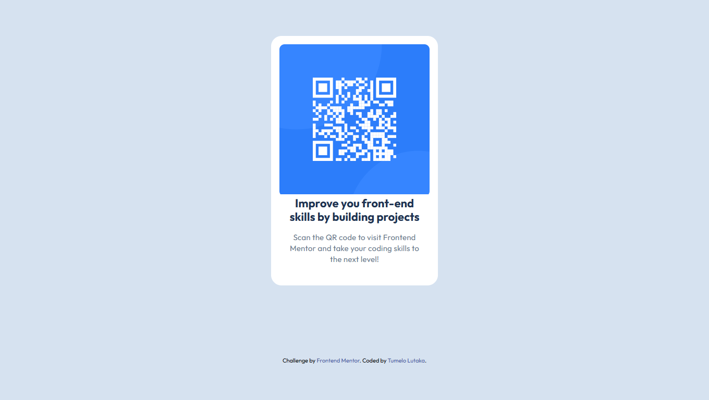

# Frontend Mentor - QR code component solution

This is a solution to the [QR code component challenge on Frontend Mentor](https://www.frontendmentor.io/challenges/qr-code-component-iux_sIO_H). Frontend Mentor challenges help you improve your coding skills by building realistic projects.

## Table of contents

- [Overview](#overview)
  - [Screenshot](#screenshot)
  - [Links](#links)
- [My process](#my-process)
  - [Built with](#built-with)
  - [What I learned](#what-i-learned)
  - [AI Collaboration](#ai-collaboration)
- [Author](#author)

## Overview

### Screenshot



### Links

- Solution URL: https://github.com/TumeloLutaka/frontend-mentor-gallery/tree/main/solutions/qr-code-component
- Live Site URL: https://tumelolutaka.github.io/frontend-mentor-gallery/solutions/qr-code-component/

## My process

### Built with

- Semantic HTML5 markup
- CSS custom properties
- Flexbox

### What I learned

I got a better appreciation for semantics HTLM and how it can help not only accessibility but my own internal understanding of how HTML layouts interact with each other.

To see how you can add code snippets, see below:

```html
<figure>
  
  <figcaption class="card__figcaption">
    <h2 class="card__title">
      Improve your front-end skills by building projects
    </h2>
    <p class="card__desc">
      Scan the QR code to visit Frontend Mentor and take your coding skills to
      the next level!
    </p>
  </figcaption>
</figure>
```

### AI Collaboration

- I used the AI tool claude to help me implement part of my semantic HTML properly, specifically with the figure and fig caption sections as these where elements I was interacting with for the first time.
- I used claude not only to show examples of how to properly apply the elements but also had it explain to me the why of using those elements over other methods.

## Author

- Frontend Mentor - [@TumeloLutaka](https://www.frontendmentor.io/profile/TumeloLutaka)
- Github - [@TumeloLutaka](https://github.com/TumeloLutaka)
