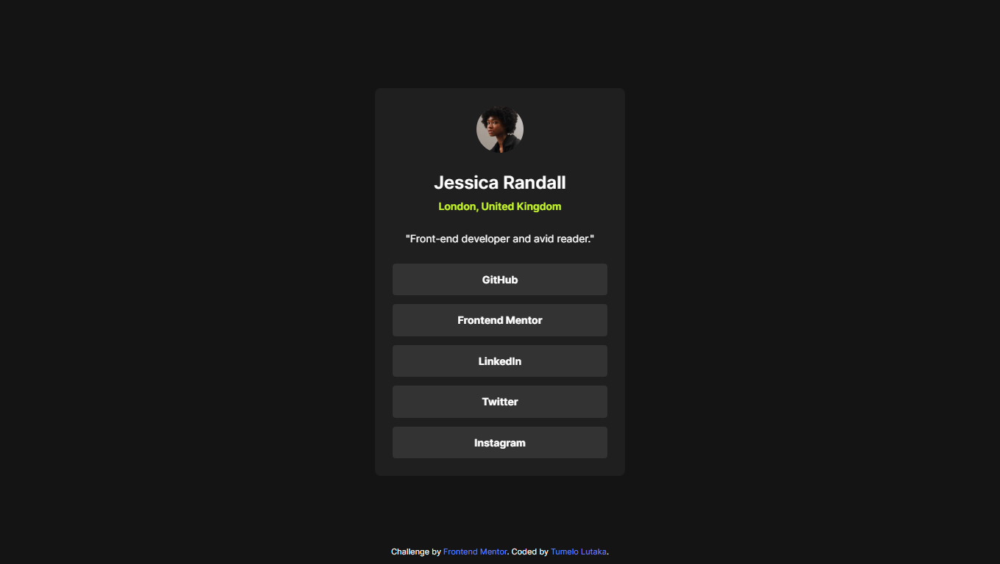

# Frontend Mentor - Social links profile solution

This is a solution to the [Social links profile challenge on Frontend Mentor](https://www.frontendmentor.io/challenges/social-links-profile-UG32l9m6dQ). Frontend Mentor challenges help you improve your coding skills by building realistic projects.

## Table of contents

- [Overview](#overview)
  - [The challenge](#the-challenge)
  - [Screenshot](#screenshot)
  - [Links](#links)
- [My process](#my-process)
  - [Built with](#built-with)
  - [What I learned](#what-i-learned)
  - [Continued development](#continued-development)
- [Author](#author)

## Overview

### The challenge

Users should be able to:

- See hover and focus states for all interactive elements on the page

### Screenshot

### Links

- Solution URL: https://github.com/TumeloLutaka/frontend-mentor-gallery/tree/main/solutions/social-links-profiles
- Live Site URL: https://tumelolutaka.github.io/frontend-mentor-gallery/solutions/social-links-profiles/

## My process

### Built with

- Semantic HTML5 markup
- CSS custom properties
- Flexbox

### What I learned

This was the first of these challenges I have undertaken where I didn't have access to a figma design file to help guide my layout. I had to rely on previous experience that I aquired from the frontend mentor challenges to eye ball the spacing and use my own intution to see what felt right. The overall experience, though more difficult that working with a readied design with exact figure, helped me think in a different perspective than previous challenges.

### Continued development

I want to focus on spacing and typography moving forward. I can appreciate how proper spacing and proper utilization of fonts along can completely change and enhance a design and provide a proper foundation for the overall end result.

## Author

- Frontend Mentor - [@TumeloLutaka](https://www.frontendmentor.io/profile/TumeloLutaka)
- Github - [@TumeloLutaka](https://github.com/TumeloLutaka)
